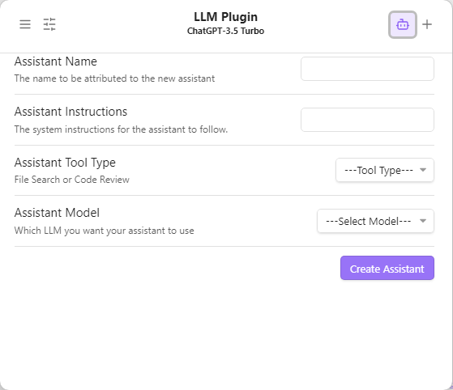
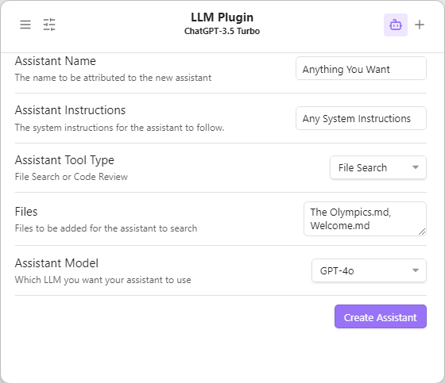
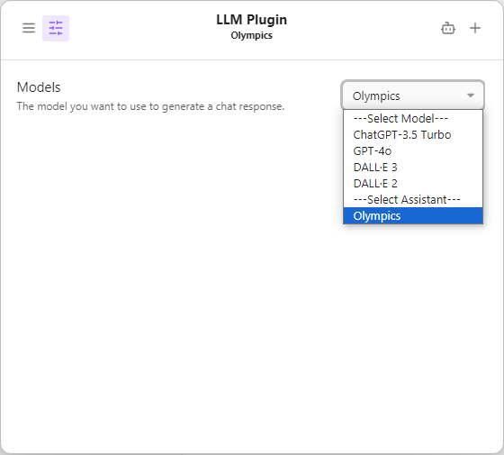

<picture>
  <source media="(prefers-color-scheme: dark)" srcset="https://github.com/user-attachments/assets/84027811-e8cc-49e8-84f3-ed5bf8225f5c">
  <source media="(prefers-color-scheme: light)" srcset="https://github.com/user-attachments/assets/f970181e-51a7-4669-a455-e4b4eecca750")
">
  
</picture>

# A Plugin for accessing LLMs through Obsidian

This plugin allows Obsidian users to access local and web LLMs. Local LLMs are available via GPT4All. Currently, OpenAI models are the only web-based LLMs available for use in the plugin. We are working on adding additional support for Google Gemini in the near future.

# Installation

This plugin in Beta and still under development so installation can be done either through the use of another Obsidian Plugin, Beta Reviewers Auto-update Tester ([BRAT](https://github.com/TfTHacker/obsidian42-brat)) - [Quick guide for using BRAT](https://tfthacker.com/Obsidian+Plugins+by+TfTHacker/BRAT+-+Beta+Reviewer's+Auto-update+Tool/Quick+guide+for+using+BRAT) (**Recommended**)

-   Search for "Obsidian42 - BRAT" in the Obsidian Community plugins.
-   Open the command palette and run the command `BRAT: Add a beta plugin for testing`
-   Paste "https://github.com/r-mahoney/Obsidian-LLM-Plugin".
-   Click on "Add Plugin".
-   After BRAT confirms the installation, in Settings go to the Community plugins tab.
-   Refresh the list of plugins.
-   Find the Obsidian LLM Plugin and enable it.

or by cloning the repo:

-   Clone this repo.
-   Make sure your NodeJS is at least v16 (`node --version`).
-   `npm i` or `yarn` to install dependencies.
-   Once the dependencies have been installed, run `npm run build` to build the plugin.
-   Once the plugin has been built, it should be ready to activate.

# Requirements

**GPT4All**

In order to use the GPT4All LLMs you must have the desktop client from [NomicAI](https://www.nomic.ai/gpt4all) downloaded to your local computer and have at least one GPT4All LLM downloaded.

-   No GPT4All models will be displayed in the Widget, FAB, or Modal settings unless you have them downloaded locally
-   In order for the plugin to have access to the GPT4All client, you must have the API Server enabled from the GPT4All settings

We currently have local doc functionality working for GPT4All models which allows users to add their Obsidian Vault to the GPT4All client and allows for chatting with models about local notes.

**OpenAI**

The OpenAI models we currently support come pre-loaded in the plugin. They include the chat models and image generation models. We are working on epxanding access to most if not all of the OpenAI endpoints.

In order to access these models, you will need to have an OpenAI account with a generated API Key and credits allowing you to make API calls. You can either generate an API Key in the LLM Plugin settings using the "Generate Token" button, or just add your API Key to the input bar. Once your API Key is input, you should have full access to the OpenAI models that we support.

# Features

Users are able to access LLMs through a variety of ways: a modal, a floating action button (FAB), and a sidebar widget. The FAB can be toggled on and off through the plugin settings or through the command pallate. The widget can be used in the sidebar or in the place of a note tab.

-   Note: The modal is being deprecated upon public release since the widget provides the same use cases.

In each of the views, you have access to Model Settings, Chat History, and New Chat options

  

  

  

Clicking the settings, or history button switches to that tab in the plugin view, to get back to the prompt tab, simply click on the highlighted button again.

-   Note: If you haven't submitted any prompts then the chat history tab will appear as an empty page that users may confuse with a broken plugin. We are working on adding an empty state to make it more apparent which tab you are on

## OpenAI Assistants for File Search

The Assistants API allows you to build AI assistants within your own applications. An Assistant has instructions and can leverage models, tools, and files to respond to user queries. The Assistants API currently supports three types of tools: Code Interpreter, File Search, and Function calling. Our team currently only supports the File Search application.

In order to use this tool, you first must navigate to the Assistants Creation tab in any of our three views by clicking on the Robot Icon in the header.
  

  
  

  You can fill out this form however you like, there's just a couple things to note
  1. You have to use an OpenAI model. If you are using GPT4All and attempt to select one of the local models, the app wont work correctly. The assistants tool is only for OpenAI models at this time
  2. You can add a single file or multiple files
     * Files must be cased the same in the text box as they are in the note title. i.e: "Daily Planning" cant be "daily planning" or "daily planning" 
     * If uploading multiple files, separate them with a comma as shown in the picture
     * You must include the file extension ".md" in the file names when you are entering them
  

    
  

  
  Once you have created an assistant, the form will become blank again and you can head over to the settings tab where you will now see your assistant listed in the models drop down. Selecting your assistant will allow you to interact with the files you just uploaded by going back to the prompt screen
  

    
  

## Local Docs for GPT4All

GPT4All makes creating a context out of all your vaults notes and bringing the information you have from files on-device into your LLM chats simple with just a few installation [steps](https://docs.gpt4all.io/gpt4all_desktop/localdocs.html#create-localdocs).

1. Click + Add Collection.
2. Name your collection and link it to a folder
    - I have found that the best way to do this is by creating a "Context" folder in my Obsidian Vault and adding any notes I want in my Local Docs to the context folder and then linking to the context folder
    - Doing this ensures that all of the other files in the vault, i.e: the .obsidian folder, are not included in the Local Docs. Otherwise GPT4All will take a long time indexing the files.
3. Click Create Collection. Progress for the collection is displayed on the LocalDocs page.
    - You will see a green Ready indicator when the entire collection is ready.
4. In the GPT4All Chat Client, open LocalDocs with button in top-right corner to give your LLM context from those files.
